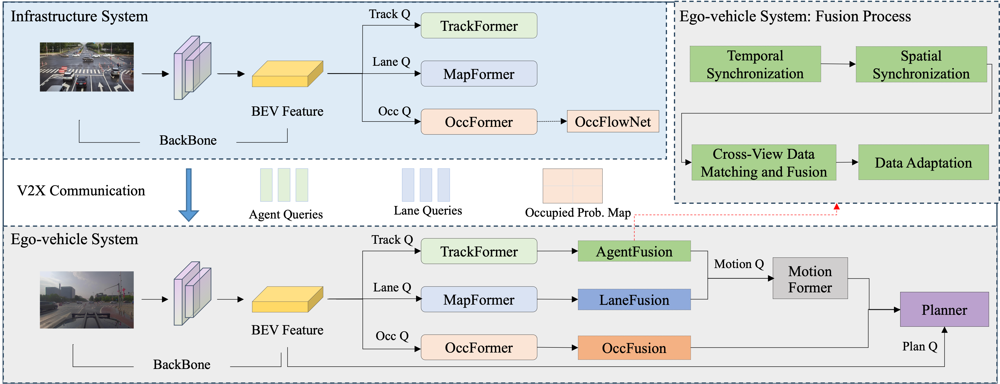

<div align="center">   
  
# End-to-End Autonomous Driving through V2X Cooperation
</div>

<h3 align="center">
  <a href="https://arxiv.org/abs/2404.00717">arXiv</a> |
  Demo[comming soon] |
  Code[comming soon]
</h3>



<br><br>

## Table of Contents:
1. [Highlights](#high)
2. [News](#news)
3. [TODO List](#todos)
4. [Citation](#citation)

## Highlights <a name="high"></a>

- UniV2X is the first cooperative autonomous driving framework that seamlessly integrates all key driving modules across diverse driving views into a unified network. 

## News <a name="news"></a>
 
- **`2024/04/02`** UniV2X [paper](https://arxiv.org/abs/2404.00717) is available on arXiv.


## TODO List <a name="todos"></a>
- [ ] Base-model code release (on DAIR-V2X)
- [ ] Base-model configs & checkpoints (on DAIR-V2X)
- [ ] Benchmark code release (on DAIR-V2X)
- [ ] Benchmark configs & checkpoints (on DAIR-V2X)
- [ ] Support more datasets


## License <a name="license"></a>

All assets and code are under the [Apache 2.0 license](./LICENSE) unless specified otherwise.

## Citation <a name="citation"></a>

Please consider citing our paper if the project helps your research with the following BibTex:

```bibtex
@inproceedings{yu2024_univ2x,
 title={End-to-End Autonomous Driving through V2X Cooperation}, 
 author={Haibao Yu and Wenxian Yang and Jiaru Zhong and Zhenwei Yang and Siqi Fan and Ping Luo and Zaiqing Nie},
 booktitle={https://arxiv.org/abs/2404.00717},
 year={2024},
}
```
## Related resources

[](https://awesome.re)
- [DAIR-V2X](https://github.com/AIR-THU/DAIR-V2X) (:rocket:Ours!)
- [FFNET](https://github.com/haibao-yu/FFNet-VIC3D) (:rocket:Ours!)
- [UniAD](https://github.com/OpenDriveLab/UniAD)
- [V2X-Sim](https://ai4ce.github.io/V2X-Sim/)
